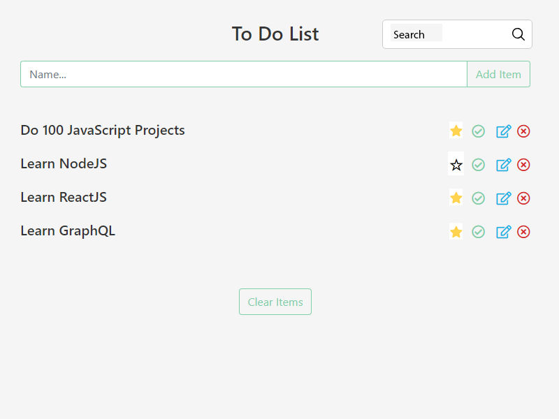

## Техническое задание:
1.  Суть задания: сделать хорошо работающий **Планировщик задач**, основываясь на PNG макете;
1.  Добавлять задачи нужно через поле сверху («Имя»), длинной не более `50 символов`;
1.  При нажатии на кнопку «Добавить элемент» или «Enter» поле ввода должно стать пустым, а новая задача добавиться в начало списка задач;
1.  Задачу с пустой строкой добавить нельзя;
1.  Порядок отображения задач:
    -  Приоритетные;
    -  Обычные;
1.  Задачу можно отметить как приоритетную, нажав на звёздочку. А также — как не приоритетную при повторном нажатии:
    -  При этом, приоритетная задача должна переместиться в самый верх списка (сперва приоритетные);
    -  А не приоритетная — обратно в список не приоритетных.

1.  Задачу можно отметить как выполненную, нажав на чекбокс слева, и как не выполненную при повторном нажатии

## **(бонус)**
1. Задачу можно отметить как выполненную
    -  При этом, задачи, отмеченные как выполненные должны перемещаться в конец списка;
    -  При перемещении из выполненных в не выполненные задача должна располагаться после приоритетных — если задача не приоритетная, или вместе с остальными приоритетными — если задача приоритетная;
        
2.  Текст задачи можно редактировать, нажав на карандашик, максимальная длинна сообщение — `50 символов`:
    -  При входе в режим редактирования ввод пользователя должен сфокусировать на элементе `<input />`;
    -  При повторном нажатии на клавишу `Enter`, новый текст задачи должен сохраниться в состоянии, а режим редактирования выключится;
    -  При нажатии на `Escape`, или при повторном нажатии на карандашик текст задачи должен вернуться в исходное состояние, до входа в режим редактирования, а режим редактирования должен выключиться.
2.  Задачу можно удалить, нажав на крестик или кнопку очистки;
2.  При вводе сообщения в поле «Поиск», задачи должны фильтроваться;
2.  Первые 2 секунды, нужно вместо приложения показывать индикатор загрузки.

## Внешний вид:

